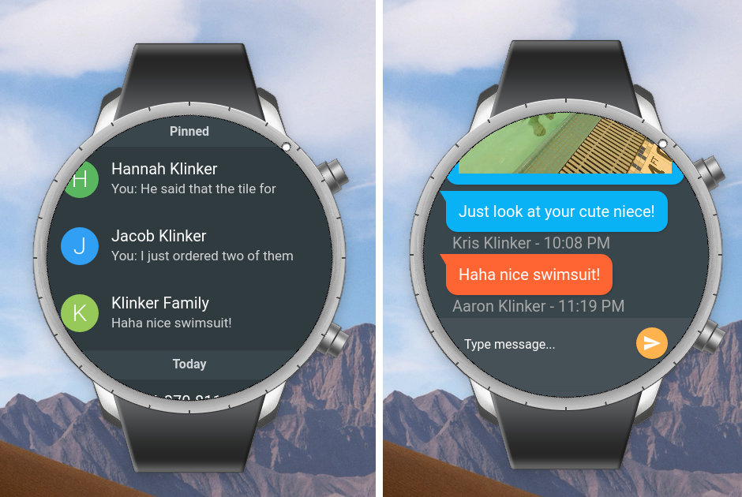

# Pulse SMS - Tizen Client

<div style="text-align:center"></div>

This version of Pulse SMS works on Tizen OS devices, specifically Samsung Galaxy watches.

It is a JavaScript based app, adapted from the Vue.js version of Pulse, that is used on the web client: https://github.com/klinker-apps/messenger-web

## Build Setup

Tizen JavaScript apps are basically just websites, packed directly onto the device.

So, this app is just a web app, packaged for Tizen. It has an adapted UI for the small screen. All of your normal web development practices will apply:

```
$ cd web

# install the dependencies
$ npm install

# run it in a browser
$ npm start
```

All debugging and work is just done using Chrome. You can make the Chrome window small and square to simulate the watch. Once the app is up and running in Chrome, you can prepare it for the Tizen deployment with:

```
$ npm run tizen
```

The `tizen` command will build the distribution version of the app and copy the files into the Tizen app directories. You can then open the app in TizenStudio to start the emulator/simulator and view the app as a wearable app.

I do all development for this app, through the browser, rather than through Tizen Studio. I have found Tizen Studio to be pretty slow.

## Contributing

Please fork this repository and contribute back using [pull requests](https://github.com/klinker-apps/messenger-tizen/pulls). Features can be requested using [issues](https://github.com/klinker-apps/messenger-issues/issues) on the Pulse SMS issue tracker/roadmap, rather than on the issues for this repo.
